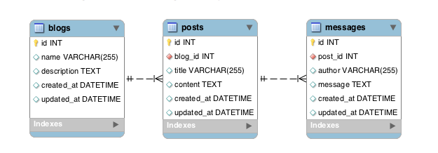

#RAILS MVC
####Relationships!
We can set up relationships amongst models
`rails g model User name:string`
`rails g model Blog title:string user:references`
What relationship can we assume from these two models?

####Updating our Model Files!
app > models > blog.rb
```ruby
class Blog < ...
  belongs_to :user # this was done for us!
end
```

app > models > user.rb
```ruby
class User < ...
  # What do we need to do here?
end
```

####Activity! Blogs Posts Messages!
Take about 20 minutes to work on...
1. Creating the models
2. Editing your model files
3. Verify with Rails Console that Post.new returns a Post record with a blog_id

