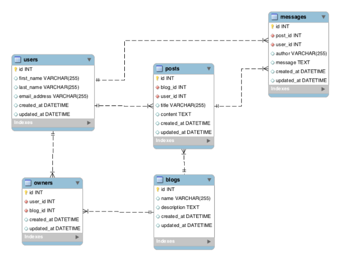

#Rails Models
####More Relationships
```ruby
class User < ActiveRecord::Base
  has_many :models #plural
  has_one :model #singular
  has_many :models, through: :middle_models #plural
end
```
|Rails Relation|Meaning|
---|---
|has_many|one-to-many|
|has_one|one-to-one|
|has_many through|many-to-many|

We <b>HAVE</b> to set up our models on the 'other side' of our relationships!  Rails is smart, but it doesn't know whether a User has one blog, many blogs, or many blogs through another intermediate model.

####Activity! Blogs Posts Messages 2!
Take about 30 minutes to...
1. Create the models for Users, Owners, and Blogs
    - Pay close attention to the relationships!
2. Edit your model files
3. Create 1 User
4. Create a Blog that is tied to User1 (There's more than one way to do it)
5. Verify with Rails Console that User1 owns the first blog by saying `User.first.blogs` or `Blog.first.users` for example.  We should get a single user or blog as a result.  We are trying to avoid errors!!!!



####Results
`rails g model User first_name:string last_name:string email_address:string`

`rails g model Blog name:string description:text`

`rails g model Owner user:references blog:references`

app > models > user.rb
```ruby
class User < ActiveRecord::Base
  has_many :blogs, through: :owners
  has_many :owners
end
```
app > models > blog.rb
```ruby
class Blog < ActiveRecord::Base
  has_many :users, through: :owners
  has_many :owners
end
```
app > models > owner.rb
```ruby
class Owner < ActiveRecord::Base
  belongs_to :user
  belongs_to :blog
end
```
`User.create(first_name:"Todd", last_name:"Blenders", email_address:"todd@todd.com")`

`User.first.blogs.create(name:"Javascript Jabber", description:"Javascript to the max!")`

`Blog.create(name:"Javascript Jabber", description:"Javascript to the max!")` & `Blog.find(2).users << User.first` and is there ANOTHER WAY?

In a <b>has_many through</b> relationship, it's not enough to say has_many :models, through: :models.  We must also say we have many of that through: :models!  This is necessary in order for the queries like `User.first.blogs` to work!

####Validations
We can validate our models before saving or updating them

app > models > user.rb
```ruby
class User < ActiveRecord::Base
  has_many :blogs, through: :owners
  has_many :owners

  EMAIL_REGEX = /\A([^@\s]+)@((?:[-a-z0-9]+\.)+[a-z]+)\z/i
  validates :first_name, :last_name, presence: true
  validates :first_name, :last_name, length: {minimum: 2}
  validates :email_address, presence: true, uniqueness: { case_sensitive: false }, format: { with: EMAIL_REGEX }
end
```
####Activity
- Update your blog model to have the following validations...
  1. Make sure there is a name and description
  2. Limit the description to greater than 10 characters but under 256 characters
  3. The name must have at least 5 characters
  4. Test your validations with these snippets in Rails Console
  - `blog = Blog.new(name:"abcd", description:"too short")`
  - `blog.valid?`

####Results
app > models > blog.rb
```ruby
class Blog < ActiveRecord::Base
  has_many :users, through: :owners
  has_many :owners

  validates :name, :description, presence: true
  validates :name, length: {minimum: 5}
  validates :description, length: {in: 10..255}
end
```
####FOR NEXT TIME:
- Have 3 users, 3 blogs ready to go
