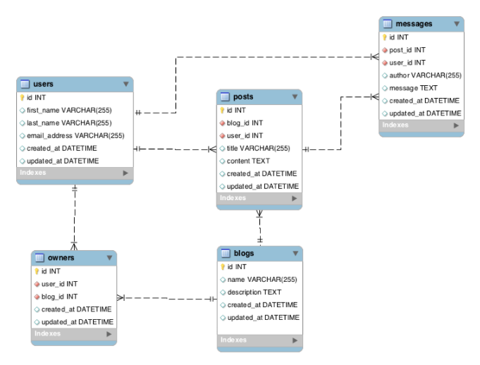

#Rails Models
####Activity: Blogs Posts Messages 2 Continued!
- Build out the Post and Message models and put in a couple validations. <b>Do you have to update the User and Blog models as well?</b>
- Verify in Rails Console that we can say `User.first.posts`
- Have User 2 create a couple posts on Blog 1
- Have User 3 create a message on Post 1


####Results
`rails g model Post title:string content:text blog:references user:references`

`rails g model Message author:string message:text post:references user:references`

app > models > post.rb
```ruby
class Post < ActiveRecord::Base
  belongs_to :blog
  belongs_to :user
  has_many :messages

  validates :title, :content, presence: true
  validates :title, :content, length: {minimum: 5}
end
```
app > models > message.rb
```ruby
class Message < ActiveRecord::Base
  belongs_to :post
  belongs_to :user

  validates :author, :message, presence: true
  validates :author, :message, length: {minimum: 2}
end
```
app > models > user.rb
```ruby
class User < ActiveRecord::Base
  has_many :blogs, through: :owners
  has_many :owners
  has_many :posts
  has_many :messages
end
```
app > models > blog.rb
```ruby
class Blog < ActiveRecord::Base
  has_many :users, through: :owners
  has_many :owners
  has_many :posts
end
```
app > models > owner.rb
```ruby
class Owner < ActiveRecord::Base
  belongs_to :user
  belongs_to :blog
end
```
####Queries
- Return how many blogs there are
- Return how many messages have been written on Post 1
- Return how many messages User 3 has written
- Return the first and last names of any users who have left posts

####Migrations!
What happens if we misspell a column name or need to add another column to our models?

We can create a migration file instead of starting all over again or destroying our models.
- We can do this in a variety of ways!
  1. `rails g migration AddPasswordToUser`
    - Rails will conveniently create a migration file found in, you guessed it, the migrations folder inside db. Example:
    ```ruby
    class AddPasswordToUser < ActiveRecord::Migration
      def change
        # we can use a bunch of different built-in methods to add, remove, rename columns, etc.
      end
    end
    ```
  2. `rails g migration AddPasswordToUser password:string`
    - Rails will ULTRA conveniently create a migration file AND determine that you want to add a password field with data-type of string to your User model!
    ```ruby
    class AddPasswordToUser < ActiveRecord::Migration
      def change
        add_column :users, :password, :string
      end
    end
    ```
Don't forget to do `rake db:migrate`

You can do lots of different things to update your existing models.  Check out the ActiveRecord Migration docs!

####Activity: Add Columns, Delete Columns, Rename Columns
1. Add a column of your choice to the User model
2. Remove the `author` column from the Message model
3. Rename the `name` column in the Blog model
