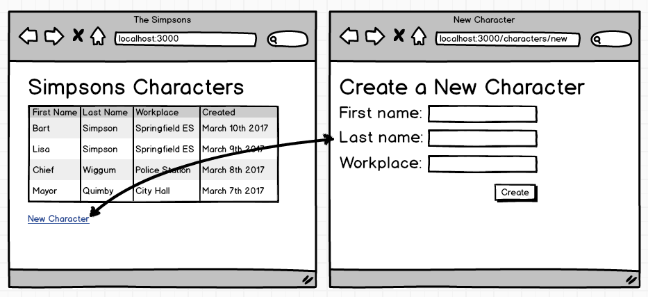

#Rails Forms, Session, Flash
####Views & Controllers Recap
- Views ==> HTML, Embedded Ruby
  - Today: Forms
- Controllers ==> Handle the Request, Call upon Models, Redirect, Render Views...
  - Today: Session & Flash

####Forms
Rails forms need a CSRF token, that thumbprint that vets the form.
```html
<form action="/users" method="post">
  <input type="hidden" name="authenticity_token" value="<%= form_authenticity_token %>">
  ...
</form>
```
<b>QUIZ</b> What's the route look like for the form above?

####Params
In order to investigate what's coming through on a form or even a route (think: `/users/2`), let's use `params`
Example:
```ruby
def create
  User.create(name: params[:name], ...) # params is a hash with key-value pairs
end
```
####Session
Session is just a hash of key-value pairs that is available in controllers and views where we can stash minimal data.  Think user IDs, names, emails, but not much else.  We can reset session with `reset_session`
Example:
```ruby
def index
  if session[:greeting] == nil
    session[:greeting] = "HEYOOO"
  end
end
```
####Flash
Flash is also just a hash of key-value pairs that is available in controllers and views as well.  However it's only around for one more request/response cycle
Example:
```ruby
def index
  flash[:message] = "BANG!"
  redirect_to "/"
end
```
<b>QUIZ</b> What is the above redirect doing and where is it going?  Will flash be available still?

####Activity: Save a New Character



1. Create a Character model based on the model below
2. Build a form to create a new character (in `new.html.erb`) based on the model below
3. Have the form <b>POST</b> to `/characters`
```ruby
class Character < ActiveRecord::Base
  validates :first_name, :last_name, :workplace, presence: true
end
```
4. Let's see where this takes us!
