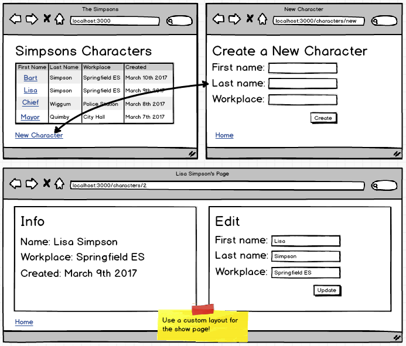

#Rails Controllers & Views
####Layouts
Just **how do** those view files get loaded into well-formed HTML files?

`APPLICATION LAYOUT`

####Custom Layouts
####Activity: Let's build a custom 2-column layout.

####Scenario
How can we throw certain view files to one layout and other view files to the normal application layout?

####Activity: Simpsons Day 2

