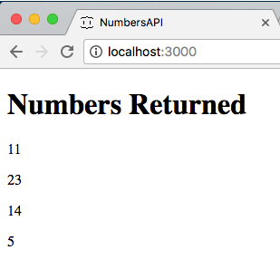
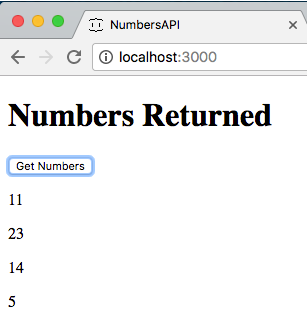
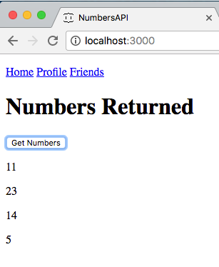

# AJAX with Rails
#### How Rails Does JSON & HTML (partials)
In order to turn our backend into an API, we can return JSON-ified data instead of rendering entire views!
```ruby
def greeting
  render json: {data: "Hello World"}
end
```
#### What do we do with returned JSON data on the front-end?
1. Catch the JSON in a callback function
```javascript
  $(document).ready(function(){
    $.get('/greeting', function(response){
      console.log(response); // response ends up being the JSON-ified data!
    }, 'json')
  })
```
2. Dive into the returned JSON
```javascript
  $(document).ready(function(){
    $.get('/greeting', function(response){
      console.log(response.data); // now we are looking at the data key!
    }, 'json')
  })
```
3. Update the DOM with the information!
  - How???

#### Activity: Create Our Own API
1. Make a rails app called `NumbersAPI`
2. Have a single controller called Numbers with two methods: `index` and `numbers_getter`
3. Your `numbers_getter` method should return a JSON with an array of numbers that you choose
4. Write the jQuery AJAX necessary to retrieve these numbers i) on page load or ii) on the click of a button, and display the numbers on your `index.html.erb` file like so:

 or 

#### How Does Rails do Partials?
Partials are smaller chunks of HTML that can be used anywhere in other views.  For example...

What if we had a navbar that shows up in several of our pages?
`views > numbers > index.html.erb`
```html
<nav>
  <ul>
    <li><a href="#">Home</a></li>
    <li><a href="#">Profile</a></li>
    <li><a href="#">Friends</a></li>
  </ul>
</nav>
<h1>Welcome to the Index Page <%= @user.name %>!</h1>
```

We can certainly reuse a partial file instead of copy/pasting
`views > navbars > _nav.html.erb`
```html
<nav>
  <ul>
    <li><a href="#">Home</a></li>
    <li><a href="#">Profile</a></li>
    <li><a href="#">Friends</a></li>
  </ul>
</nav>
```
- Preface your partial filename with an underscore `_`
- To load it on another view file...

`views > numbers > index.html.erb`
```html
<%= render partial: 'navbars/nav' %>
<h1>Welcome to the Index Page <%= @user.name %>!</h1>
```

#### Activity: Create a Partial
- Create a partial of your own (be creative) and have it show up in the previous activity's `index.html.erb`
- Need inspiration?



#### How Do We Render a Partial from a Controller Though?
We don't always have to send back JSON from our server.  We can send HTML!

The partial we just rendered was directly in the view and wasn't doing an AJAX call to do so.

What if...
```javascript
  $(document).ready(function(){
    $.get('/users/1', function(response){
      console.log(response); // response ends up being an HTML string!
    }, 'html') // <=== note the 'html'
  })
```

```ruby
def user_partial
  user = User.find(params[:id])
  return render partial: "user", locals: {user: user}
end
```

We could have a partial set up called `_user.html.erb` but be mindful where you save it.

#### Demo: Finish Up the Example Above
